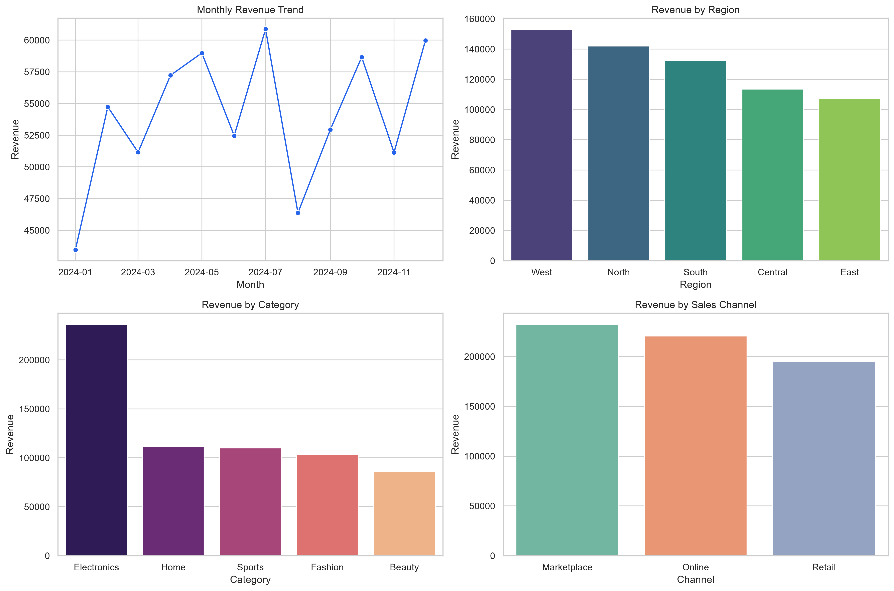

# Amaragani Nikhil Sai

**Aspiring Data Analyst | Business Intelligence | Data Storytelling**

Computer Science graduate based in Hyderabad, India. Building toward entry-level Data Analyst and BI Analyst roles through structured study and portfolio projects. Open to suitable international opportunities, including Europe.

[LinkedIn](https://www.linkedin.com/in/nikhil-sai-amaragani-219115382) · [Email](mailto:nikhilamaragani@gmail.com) · [IBM course certificate](https://coursera.org/verify/E6Z1ON902KHZ)

## Profile

My long-term goal is to become a **Data Analyst Specialist** with strong practical foundations in business analysis, data preparation, SQL, Python, and BI reporting. I’m progressing step by step and aim to make each stage visible through verifiable credentials and reproducible work.

My first milestone is **IBM’s Introduction to Data Analytics**, completed through Coursera on October 3, 2026. This is **course 1** of the IBM Data Analyst Professional Certificate; I have not completed the full professional certificate.

## Analytics work

### Claims Operations: Analyst Foundations

A scoped practice case study focused on framing an operational question, checking data quality, calculating descriptive KPIs, and documenting assumptions and limitations. It uses synthetic data and does not represent a real insurer, real customers, or actual European market performance.

[Project brief](https://github.com/nikhilamaragani-jpg/certificates-achievements/blob/nikhilamaragani-jpg-elite-certificates-profile/projects/claims-intelligence-foundation/README.md)

### Retail Performance & Customer Insights

A Python practice project that generates a synthetic retail dataset, summarizes sales performance, and produces a dashboard and business recommendations. All figures are illustrative, not real business results.

[Project files](projects/data-analyst-capstone/) · [Project brief](docs/DATA_ANALYST_PORTFOLIO_PROJECT.md) · [Dashboard preview](projects/data-analyst-capstone/outputs/data_analyst_dashboard.png)

### Power BI workshop dashboards

Workshop artifacts covering sales and media-analysis examples. These are learning exercises, not commercial client work.

[Dashboard collection](https://github.com/nikhilamaragani-jpg/certificates-achievements/blob/nikhilamaragani-jpg-elite-certificates-profile/workshop-evidence/Power-BI-Workshop-Dashboards.pdf) · [Sales analysis](https://github.com/nikhilamaragani-jpg/certificates-achievements/blob/nikhilamaragani-jpg-elite-certificates-profile/workshop-evidence/Power-BI-Workshop-Dashboards.pdf#page=1) · [Netflix analysis](https://github.com/nikhilamaragani-jpg/certificates-achievements/blob/nikhilamaragani-jpg-elite-certificates-profile/workshop-evidence/Power-BI-Workshop-Dashboards.pdf#page=2)

## Learning roadmap

| Stage | Focus | Status |
|---|---|---|
| 1 | IBM Introduction to Data Analytics | **Completed** |
| 2 | Excel for data analysis | Next in the IBM learning path |
| 3 | Data visualization and dashboards | Planned |
| 4 | Python, SQL, data analysis, and visualization | Planned |
| 5 | Capstone projects, advanced BI, and job preparation | Planned |

**Current learning focus:** Excel · SQL · Python · Power BI · analytical problem-solving

I distinguish planned study from demonstrated project experience and will update this profile as I complete each stage.

## Credentials and education

- **IBM — Introduction to Data Analytics**, Coursera, completed October 3, 2026. [Verify certificate](https://coursera.org/verify/E6Z1ON902KHZ) · [Certificate file](https://github.com/nikhilamaragani-jpg/certificates-achievements/blob/nikhilamaragani-jpg-elite-certificates-profile/certificates/IBM-Introduction-to-Data-Analytics-Coursera.pdf)
- **Power BI and Python workshops:** [certificates](https://github.com/nikhilamaragani-jpg/certificates-achievements/tree/nikhilamaragani-jpg-elite-certificates-profile/certificates)
- **B.Tech in Computer Science and Engineering**, SIIET (JNTUH), graduated 2026

## Contact

[LinkedIn](https://www.linkedin.com/in/nikhil-sai-amaragani-219115382) · [Email](mailto:nikhilamaragani@gmail.com)
